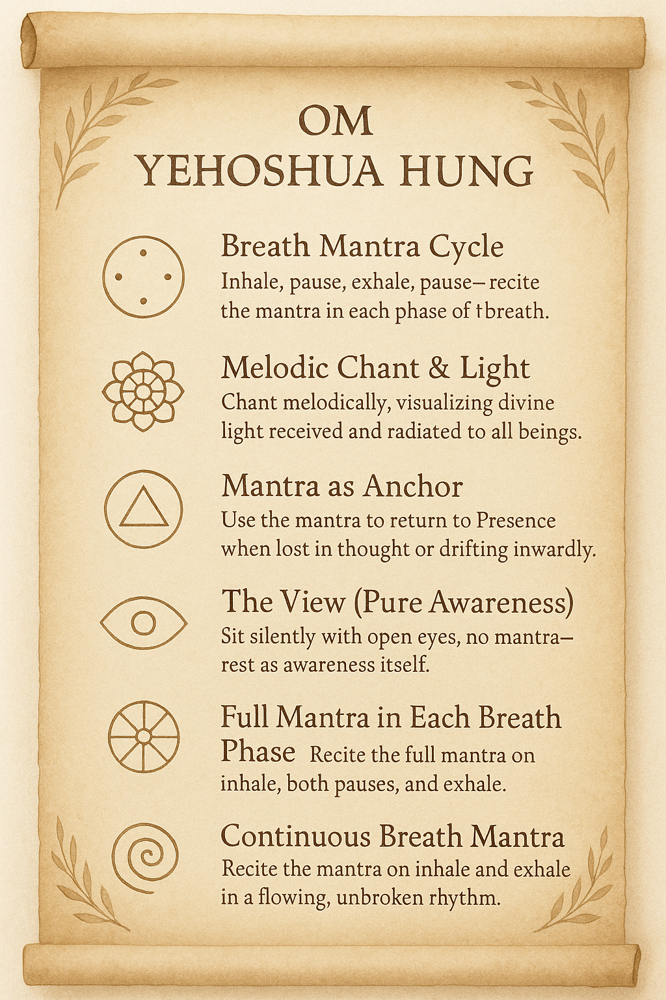

# 🌿 The Sixfold Mantra Path of OM YEHOSHUA HUNG

> *A contemplative unfolding of mantra and breath into Presence.*

This scroll illustrates six distinct but interconnected ways of practicing the sacred mantra **OM YEHOSHUA HUNG**. Each variation offers a unique doorway into stillness, compassion, and divine remembrance. These practices are adaptive to the energy levels and spiritual depth of each day.

---

## 🧘‍♂️ 1. **Breath Mantra Cycle**  
*Inhale, pause, exhale, pause — recite the mantra in each phase of the breath.*  
A meditative rhythm that mirrors the tides of life.

---

## 🎶 2. **Melodic Chant & Radiant Light**  
*Chant melodically, visualizing divine light received and radiated to all beings.*  
A practice of devotional song and luminous transmission.

---

## 🔔 3. **Mantra as Anchor**  
*Use the mantra to return to Presence when lost in thought or drifting inwardly.*  
A gentle tether to stillness in daily life.

---

## 🕊️ 4. **The View (Pure Awareness)**  
*Sit silently with open eyes, no mantra — rest as awareness itself.*  
Beyond technique, there is only presence.

---

## 🌬️ 5. **Full Mantra in Each Breath Phase**  
*Recite the full mantra on inhale, both pauses, and exhale.*  
Complete integration of mantra and breath.

---

## 🌊 6. **Continuous Breath Mantra**  
*Recite the mantra on inhale and exhale in a flowing, unbroken rhythm.*  
Let the mantra breathe itself — soft, steady, alive.

---

> *“Each variation is a thread in the tapestry of sacred remembrance.  
Return to the one that meets your breath today.”*

